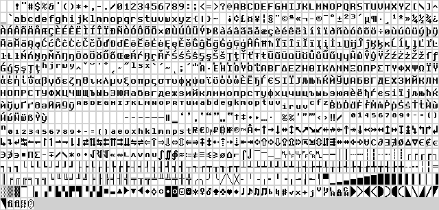
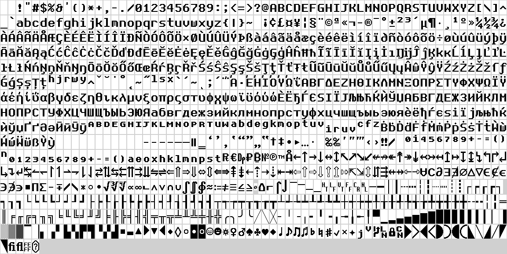

# psfnova

PSF Nova is a monospaced font primarily designed for VT use (as a PSFU bitmap font), but in the
future, we intend to also provide a TrueType version for general use. I’ve been using this font
for decades now, but never published it — what I had was `cp850-8x16.psfu` edited by hand with a
binary editor. This new version, while keeping the original design, adds many more glyphs, and can
be built for many different charsets. It also is available in two sizes: 1x (8x16) and 2x (16x32).

## Specimens

**Specimen @1x (8x16)**

**Specimen @2x (16x32)**

## Available pre-built fonts

### 256-glyph fonts

- [`psfnova-cp437-8x16.psfu`](./fonts/psfnova-cp437-8x16.psfu)/
  [`psfnova-cp437-16x32.psfu`](./fonts/psfnova-cp437-16x32.psfu): [cp437]

- [`psfnova-cp737-8x16.psfu`](./fonts/psfnova-cp737-8x16.psfu)/
  [`psfnova-cp737-16x32.psfu`](./fonts/psfnova-cp737-16x32.psfu): [cp737]

- [`psfnova-cp775-8x16.psfu`](./fonts/psfnova-cp775-8x16.psfu)/
  [`psfnova-cp775-16x32.psfu`](./fonts/psfnova-cp775-16x32.psfu): [cp775]

- [`psfnova-cp850-8x16.psfu`](./fonts/psfnova-cp850-8x16.psfu)/
  [`psfnova-cp850-16x32.psfu`](./fonts/psfnova-cp850-16x32.psfu): [cp850]

- [`psfnova-cp852-8x16.psfu`](./fonts/psfnova-cp852-8x16.psfu)/
  [`psfnova-cp852-16x32.psfu`](./fonts/psfnova-cp852-16x32.psfu): [cp852]

- [`psfnova-cp857-8x16.psfu`](./fonts/psfnova-cp857-8x16.psfu)/
  [`psfnova-cp857-16x32.psfu`](./fonts/psfnova-cp857-16x32.psfu): [cp857]

- [`psfnova-cp858-8x16.psfu`](./fonts/psfnova-cp858-8x16.psfu)/
  [`psfnova-cp858-16x32.psfu`](./fonts/psfnova-cp858-16x32.psfu): [cp858]

- [`psfnova-cp860-8x16.psfu`](./fonts/psfnova-cp860-8x16.psfu)/
  [`psfnova-cp860-16x32.psfu`](./fonts/psfnova-cp860-16x32.psfu): [cp860]

- [`psfnova-cp861-8x16.psfu`](./fonts/psfnova-cp861-8x16.psfu)/
  [`psfnova-cp861-16x32.psfu`](./fonts/psfnova-cp861-16x32.psfu): [cp861]

- [`psfnova-cp863-8x16.psfu`](./fonts/psfnova-cp863-8x16.psfu)/
  [`psfnova-cp863-16x32.psfu`](./fonts/psfnova-cp863-16x32.psfu): [cp863]

- [`psfnova-cp865-8x16.psfu`](./fonts/psfnova-cp865-8x16.psfu)/
  [`psfnova-cp865-16x32.psfu`](./fonts/psfnova-cp865-16x32.psfu): [cp865]

- [`psfnova-cp866-8x16.psfu`](./fonts/psfnova-cp866-8x16.psfu)/
  [`psfnova-cp866-16x32.psfu`](./fonts/psfnova-cp866-16x32.psfu): [cp866]

- [`psfnova-cp869-8x16.psfu`](./fonts/psfnova-cp869-8x16.psfu)/
  [`psfnova-cp869-16x32.psfu`](./fonts/psfnova-cp869-16x32.psfu): [cp869]

- [`psfnova-koi8_r-8x16.psfu`](./fonts/psfnova-koi8_r-8x16.psfu)/
  [`psfnova-koi8_r-16x32.psfu`](./fonts/psfnova-koi8_r-16x32.psfu): [koi8_r]

- [`psfnova-koi8_u-8x16.psfu`](./fonts/psfnova-koi8_u-8x16.psfu)/
  [`psfnova-koi8_u-16x32.psfu`](./fonts/psfnova-koi8_u-16x32.psfu): [koi8_u]

- [`psfnova-ruscii-8x16.psfu`](./fonts/psfnova-ruscii-8x16.psfu)/
  [`psfnova-ruscii-16x32.psfu`](./fonts/psfnova-ruscii-16x32.psfu): [ruscii]

### 512-glyph fonts

- [`psfnova-pan_latin-8x16.psfu`](./fonts/psfnova-pan_latin-8x16.psfu)/
  [`psfnova-pan_latin-16x32.psfu`](./fonts/psfnova-pan_latin-16x32.psfu): [cp437], [cp775],
  [cp850], [cp852], [cp857], [cp858], [cp859], [cp860], [cp861], [cp863], [cp865], [iso-8859-1],
  [iso-8859-2], [iso-8859-3], [iso-8859-4], [iso-8859-9], [iso-8859-13], [iso-8859-14],
  [iso-8859-15], [iso-8859-16], [windows-1250], [windows-1252], [windows-1254], [windows-1257],
  [mac-iceland], [mac-latin2], [mac-roman], [mac-turkish], [general-punctuation],
  [dec-special-graphics], [powerline]

- [`psfnova-greek+eastern_european-8x16.psfu`](./fonts/psfnova-greek+eastern_european-8x16.psfu)/
  [`psfnova-greek+eastern_european-16x32.psfu`](./fonts/psfnova-greek+eastern_european-16x32.psfu):
  [cp437], [cp737], [cp850], [cp852], [cp857], [cp858], [cp869], [iso-8859-1], [iso-8859-2],
  [iso-8859-9], [iso-8859-15], [iso-8859-16], [windows-1250], [windows-1252], [windows-1253],
  [windows-1254], [mac-greek], [mac-latin2], [mac-roman], [mac-turkish], [general-punctuation],
  [dec-special-graphics], [powerline]

[cp437]: https://en.wikipedia.org/w/index.php?title=Code_page_437&oldid=1334928329
[cp737]: https://en.wikipedia.org/w/index.php?title=Code_page_737&oldid=1341919740
[cp775]:
  https://en.wikibooks.org/w/index.php?title=Character_Encodings/Code_Tables/MS-DOS/Code_page_775&oldid=4473425
[cp850]: https://en.wikipedia.org/w/index.php?title=Code_page_850&oldid=1327841397
[cp852]:
  https://en.wikibooks.org/w/index.php?title=Character_Encodings/Code_Tables/MS-DOS/Code_page_852&oldid=4471776
[cp857]:
  https://en.wikibooks.org/w/index.php?title=Character_Encodings/Code_Tables/MS-DOS/Code_page_857&oldid=4622771
[cp858]: https://en.wikipedia.org/w/index.php?title=Code_page_850&oldid=1327841397#Code_page_858
[cp859]:
  https://en.wikibooks.org/w/index.php?title=Character_Encodings/Code_Tables/MS-DOS/Code_page_859&oldid=4471778
[cp860]:
  https://en.wikibooks.org/w/index.php?title=Character_Encodings/Code_Tables/MS-DOS/Code_page_860&oldid=4471779
[cp861]: https://en.wikipedia.org/w/index.php?title=Code_page_861&oldid=1337825541
[cp863]: https://en.wikipedia.org/w/index.php?title=Code_page_863&oldid=1242296611
[cp865]: https://en.wikipedia.org/w/index.php?title=Code_page_865&oldid=1242296619
[cp866]: https://en.wikipedia.org/w/index.php?title=Code_page_866&oldid=1327838792
[cp869]: https://en.wikipedia.org/w/index.php?title=Code_page_869&oldid=1242296636
[koi8_r]: https://en.wikipedia.org/w/index.php?title=KOI8-R&oldid=1322912093
[koi8_u]: https://en.wikipedia.org/w/index.php?title=KOI8-U&oldid=1322910955
[ruscii]:
  https://en.wikipedia.org/w/index.php?title=Code_page_866&oldid=1327838792#Modified_code_page_866
[iso-8859-1]: https://en.wikipedia.org/w/index.php?title=ISO/IEC_8859-1&oldid=1340796580
[iso-8859-2]: https://en.wikipedia.org/w/index.php?title=ISO/IEC_8859-2&oldid=1334893082
[iso-8859-3]: https://en.wikipedia.org/w/index.php?title=ISO/IEC_8859-3&oldid=1340829150
[iso-8859-4]: https://en.wikipedia.org/w/index.php?title=ISO/IEC_8859-4&oldid=1340829611
[iso-8859-9]: https://en.wikipedia.org/w/index.php?title=ISO/IEC_8859-9&oldid=1340828646
[iso-8859-13]: https://en.wikipedia.org/w/index.php?title=ISO/IEC_8859-13&oldid=1340829385
[iso-8859-14]: https://en.wikipedia.org/w/index.php?title=ISO/IEC_8859-14&oldid=1340829266
[iso-8859-15]: https://en.wikipedia.org/w/index.php?title=ISO/IEC_8859-15&oldid=1340829202
[iso-8859-16]: https://en.wikipedia.org/w/index.php?title=ISO/IEC_8859-16&oldid=1340829732
[mac-greek]: https://en.wikipedia.org/w/index.php?title=Mac_OS_Greek_encoding&oldid=1328020428
[mac-iceland]:
  https://en.wikipedia.org/w/index.php?title=Mac_OS_Icelandic_encoding&oldid=1335411444
[mac-latin2]:
  https://en.wikipedia.org/w/index.php?title=Mac_OS_Central_European_encoding&oldid=1335399138
[mac-roman]: https://en.wikipedia.org/w/index.php?title=Mac_OS_Roman&oldid=1340826715
[mac-turkish]: https://en.wikipedia.org/w/index.php?title=Mac_OS_Turkish_encoding&oldid=1344081296
[windows-1250]: https://en.wikipedia.org/w/index.php?title=Windows-1250&oldid=1340825637
[windows-1252]: https://en.wikipedia.org/w/index.php?title=Windows-1252&oldid=1343504959
[windows-1253]: https://en.wikipedia.org/w/index.php?title=Windows-1253&oldid=1340825570
[windows-1254]: https://en.wikipedia.org/w/index.php?title=Windows-1254&oldid=1340825506
[windows-1257]: https://en.wikipedia.org/w/index.php?title=Windows-1257&oldid=1340825248
[dec-special-graphics]:
  https://en.wikipedia.org/w/index.php?title=DEC_Special_Graphics&oldid=1329273805
[general-punctuation]:
  https://en.wikipedia.org/w/index.php?title=General_Punctuation&oldid=1312666994
[powerline]:
  https://github.com/ryanoasis/powerline-extra-symbols/tree/ae05de7c51f6609479f4f1a4a0f6f65631731c1b
